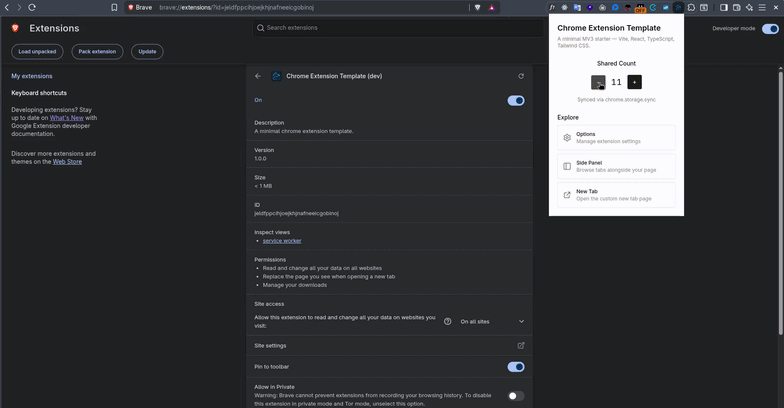

# Chrome Extension Template

<p align="center">
  
</p>

A modern Chrome extension (MV3) starter with Vite, React 19, TypeScript 7, Tailwind CSS v4, the React Compiler, and full HMR via `@crxjs/vite-plugin`.

## Demo



## Features

- **MV3 Manifest** — ready-to-use `manifest.config.ts` with all extension entry points configured
- **Multi-Entry Scaffolding** — popup, options, side panel, devtools, new tab, background service worker, and content script
- **Full HMR** — `@crxjs/vite-plugin` hot-reloading for every entry point during development
- **React 19 + React Compiler** — automatic memoization via `babel-plugin-react-compiler`
- **TypeScript 7** — strict config with `tsconfig.json`, path aliases, and auto-generated type files
- **Tailwind CSS v4** — utility-first CSS with generated theme aliases and CSS variables
- **shadcn/ui** — pre-configured component library with Button and UI primitives
- **Biome** — linting, formatting, and checking in one toolchain (`biome.json`)
- **Bun** — fast dependency management and all scripts run on Bun
- **Icon Pipeline** — single `icon.png` auto-resized to 16×, 48×, and 128× via ImageMagick
- **Messaging Layer** — typed `chrome.runtime` messaging abstraction (`src/lib/messaging.ts`)
- **Chrome Storage Hook** — reactive `useStorage` hook built on `chrome.storage`

## Getting Started

```bash
# Install dependencies
bun install

# Build the extension
bun run build
```

Load the `dist/` directory in Chrome via `chrome://extensions` → **Load unpacked**.

## Development

```bash
bun run dev       # Dev server with HMR for popup, background, and content scripts
bun run build     # Production build → dist/
bun run preview   # Preview the production build
```

## Icon

Place a square `icon.png` in `public/` (at least 128×128), then generate the required sizes:

```bash
bun run sync
```

This creates `public/generated/icon-{16,48,128}.png` via ImageMagick. Runs automatically before every build.

## Linting & Formatting

```bash
bun run lint     # Biome lint
bun run format   # Biome format
bun run check    # Biome check (lint + format)
```

## Structure

```
├── public/
│   ├── icon.png                  # Source icon (required, ≥128×128)
│   ├── demo.gif                  # Showcase GIF
│   └── generated/                # Auto-generated icon sizes (16/48/128)
├── src/
│   ├── vite-env.d.ts             # Vite type declarations
│   ├── entries/                  # Extension entry points
│   │   ├── popup/                # Browser action popup
│   │   │   ├── App.tsx
│   │   │   ├── main.tsx
│   │   │   └── index.html
│   │   ├── options/              # Options page
│   │   │   ├── App.tsx
│   │   │   ├── main.tsx
│   │   │   └── index.html
│   │   ├── sidepanel/            # Side panel
│   │   │   ├── App.tsx
│   │   │   ├── main.tsx
│   │   │   └── index.html
│   │   ├── devtools/             # DevTools panel
│   │   │   ├── App.tsx
│   │   │   ├── main.tsx
│   │   │   └── index.html
│   │   ├── newtab/               # Chrome new tab override
│   │   │   ├── App.tsx
│   │   │   ├── main.tsx
│   │   │   └── index.html
│   │   ├── background/           # Service worker
│   │   │   └── index.ts
│   │   └── content/              # Content script (injected into pages)
│   │       └── index.ts
│   ├── lib/                      # Core libraries
│   │   ├── extension.ts          # Extension utilities
│   │   ├── messaging.ts          # Typed runtime messaging
│   │   ├── storage.ts            # Chrome storage wrapper
│   │   ├── utils.ts              # General helpers
│   │   └── generated/            # Auto-generated files
│   │       └── icons-spec.gen.ts
│   ├── types/                    # TypeScript types
│   │   ├── color.types.ts
│   │   ├── messages.types.ts
│   │   └── storage.types.ts
│   ├── hooks/                    # React hooks
│   │   ├── use-chrome-tabs.ts
│   │   └── use-storage.ts
│   ├── styles/                   # Global CSS
│   │   ├── colors.css
│   │   └── globals.css
│   ├── components/               # React components
│   │   └── ui/
│   │       ├── button.tsx
│   │       └── .gitkeep
│   └── assets/                   # Static assets
│       └── .gitkeep
├── scripts/                      # Build & codegen scripts
│   ├── extract-icons.ts          # Icon extraction script
│   └── generate-theme-aliases.sh # Tailwind color alias generator
├── manifest.config.ts            # MV3 manifest (CRXJS defineManifest)
├── vite.config.ts                # Vite config (CRXJS plugin)
├── tsconfig.json                 # TypeScript config (strict, path aliases)
├── biome.json                    # Linter & formatter config
├── components.json               # shadcn/ui config
└── package.json
```

## License

MIT
